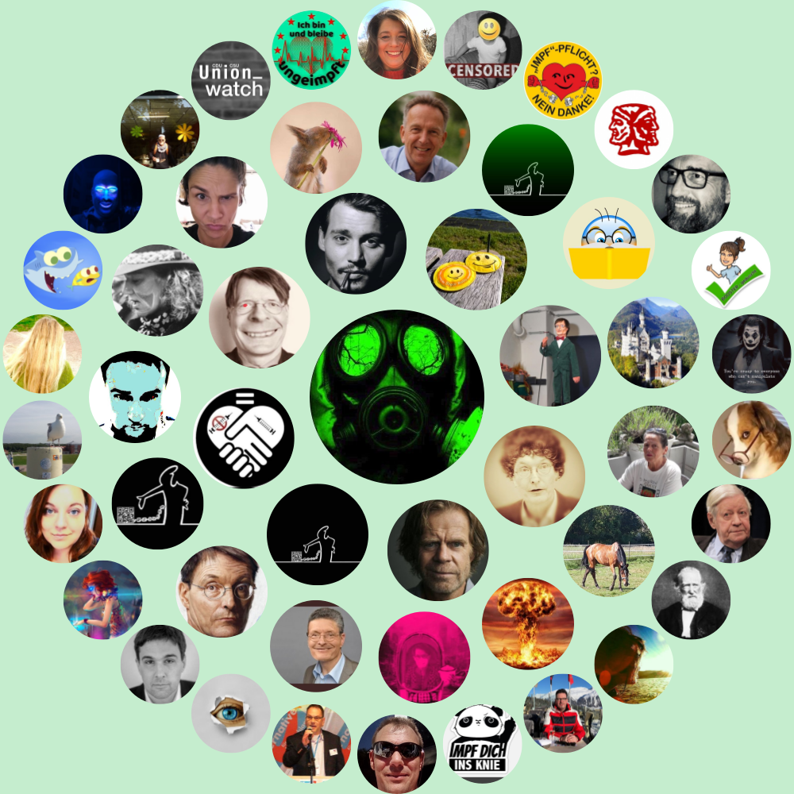

# Twitter Interaction Circle

Originally from [Twopcharts](https://twopcharts.com/) it has been making the round in the dev community.
I believe this is a great opportunity for a project to learn from. 
The concept is easy and straightforward but the realization encompasses a lot of concepts.

You can read more about the realization of this project on the [HackerTyper Blog](https://blog.hackertyper.net/post/twitter-interaction-circles-guide/)


## Installation
```shell script
git clone git@github.com:duiker101/twitter-interaction-circle.git
cd twitter-interaction-circle
yarn install
```

Run with 
```shell script
yarn build
```

## Setup
To use the project you will need Twitter API keys. You can get one on the [developer portal](https://developer.twitter.com).

Once you have them, rename the `.env.example` file `.env` and put them in there, it should look like this:

```dotenv
CONSUMER_KEY=AAAAAAA
CONSUMER_SECRET=BBBBBBB
ACCESS_TOKEN_KEY=CCCCCCC
ACCESS_TOKEN_SECRET=DDDDD
```

Make sure you don't have spaces.

## Challenges

You can try to apply the following changes to test your knowledge:
- Apply a shade to  each avatar based on the most common type of interaction
- Fetch the circles for another user
- Render a grid instead of the circles
